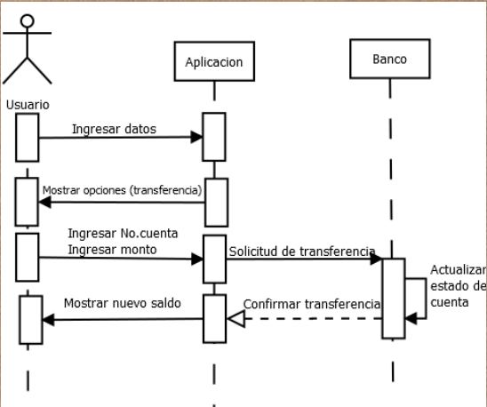

# Sistema de Banco

## Descripción

El **Sistema de Banco** es un programa que simula las operaciones de un banco. Permite a los usuarios realizar operaciones como transferir, depositar, retirar y mostrar su saldo. Además, el sistema permite registrar nuevos usuarios e iniciar sesión.

El objetivo de esta práctica es implementar un sistema de banco utilizando el lenguaje de programación Python y el paradigma de programación orientada a objetos, aplicando los conceptos de programación orientada a objetos vistos en clase.

## Requerimientos

- Implementado en el lenguaje de programación Python.
- Utiliza el paradigma de programación orientada a objetos.
- Debe contar con las siguientes operaciones:
    - **Transferir**
    - **Depositar**
    - **Retirar**
    - **Mostrar saldo**
    - **Registrar usuario**
    - **Iniciar sesión**

## Diagrama de Secuencia



## Diagrama de Flujo


## Estructura del Código

A continuación, se presenta una posible estructura de clases para el sistema de banco:

### Clase `Usuario`

```python
class Usuario:
    def __init__(self, id_usuario, nombre_usuario, saldo, cuentas):
        self.id_usuario = id_usuario
        self.nombre_usuario = nombre_usuario
        self.saldo = saldo
        self.cuentas = cuentas
    
    def mostrar_saldo(self):
        print(f"Saldo de la cuenta: {self.saldo}")

    # Métodos adicionales para transferir, depositar y retirar
```

### Clase `Cuenta`

```python
class Cuenta:
    def __init__(self, tipo, saldo):
        self.tipo = tipo
        self.saldo = saldo
    
    def mostrar_saldo(self):
        print(f"Tipo de cuenta: {self.tipo}, Saldo: {self.saldo}")

    # Métodos adicionales para depositar, retirar
```

### Funciones del Sistema

#### Registrar Usuario

```python
def registrar_usuario(usuarios, id_usuario, nombre_usuario, saldo_inicial):
    if any(usuario.id_usuario == id_usuario for usuario in usuarios):
        print("El ID de usuario ya existe.")
    else:
        nueva_cuenta = Cuenta('Ahorro', saldo_inicial)
        nuevo_usuario = Usuario(id_usuario, nombre_usuario, saldo_inicial, [nueva_cuenta])
        usuarios.append(nuevo_usuario)
        print("Usuario registrado con éxito.")
```

#### Iniciar Sesión

```python
def iniciar_sesion(usuarios, id_usuario):
    for usuario in usuarios:
        if usuario.id_usuario == id_usuario:
            print("Inicio de sesión exitoso.")
            return usuario
    print("ID de usuario no encontrado.")
    return None
```

#### Mostrar Cuenta

```python
from colorama import Fore, Style, init

init(autoreset=True)

def Mostrar_cuenta():
    id_usuario = input("Ingrese el ID de usuario: ")
    usuario_encontrado = False
    for usuario in usuarios:
        if usuario.id_usuario == id_usuario:
            usuario_encontrado = True
            print(Fore.GREEN + "==============================")
            print(Fore.YELLOW + f"Nombre de usuario: {usuario.nom_usuario}")
            print(Fore.YELLOW + f"ID de usuario: {usuario.id_usuario}")
            print(Fore.YELLOW + f"Saldo de la cuenta: {usuario.saldo}")
            for cuenta in usuario.cuentas:
                print(Fore.CYAN + f"Tipo de cuenta: {cuenta.tipo}")
                print(Fore.CYAN + f"Saldo: {cuenta.saldo}")
            print(Fore.GREEN + "==============================")
            break
    if not usuario_encontrado:
        print(Fore.RED + "No se encontró el usuario con el ID proporcionado.")
```

#### Depositar

```python
def depositar(usuario, cantidad):
    usuario.saldo += cantidad
    usuario.cuentas[0].saldo += cantidad
    print(f"Depósito de {cantidad} realizado con éxito. Saldo actual: {usuario.saldo}")
```

#### Retirar

```python
def retirar(usuario, cantidad):
    if usuario.saldo >= cantidad:
        usuario.saldo -= cantidad
        usuario.cuentas[0].saldo -= cantidad
        print(f"Retiro de {cantidad} realizado con éxito. Saldo actual: {usuario.saldo}")
    else:
        print("Saldo insuficiente.")
```

#### Transferir

```python
def transferir(usuario_origen, usuario_destino, cantidad):
    if usuario_origen.saldo >= cantidad:
        usuario_origen.saldo -= cantidad
        usuario_origen.cuentas[0].saldo -= cantidad
        usuario_destino.saldo += cantidad
        usuario_destino.cuentas[0].saldo += cantidad
        print(f"Transferencia de {cantidad} realizada con éxito.")
    else:
        print("Saldo insuficiente para realizar la transferencia.")
```